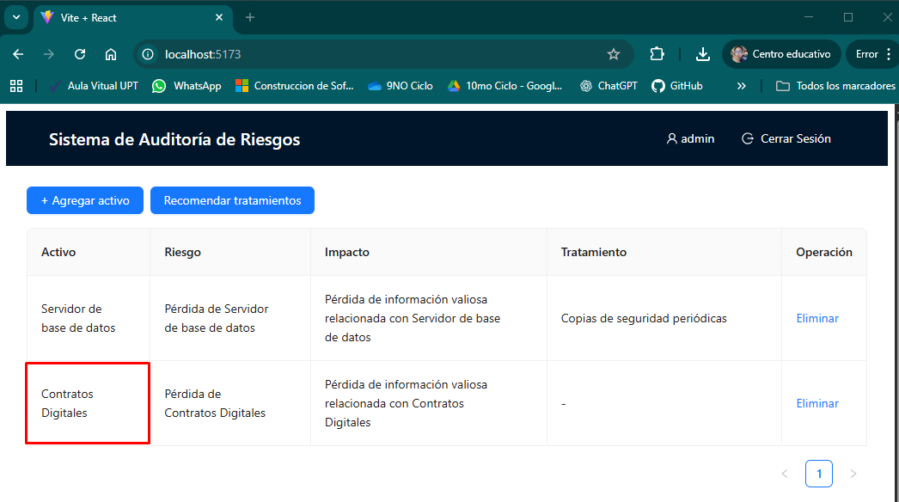

# Informe de Auditoría de Sistemas
# Examen de Unidad I

**Nombres y apellidos:** Jorge Luis Briceño Diaz
**Fecha:** 10/09/2025
**URL GitHub:** https://github.com/J0rgZ/ExamenAuditoria.git

---

## 1. Proyecto de Auditoría de Riesgos

### Login

**Evidencia:**

**Descripción:**
La funcionalidad de inicio de sesión ficticio se ha implementado en el frontend de la aplicación utilizando React. Consiste en un formulario con campos para usuario y contraseña. Al ingresar las credenciales predefinidas (`usuario: admin`, `contraseña: 123456`), el sistema simula un acceso exitoso y redirige al usuario a la interfaz principal de gestión de riesgos. La validación se realiza directamente en el código del componente React, sin necesidad de una base de datos, cumpliendo con el requisito de un login ficticio.

---

### Motor de Inteligencia Artificial

**Evidencia:**

**Descripción:**
El motor de inteligencia artificial ha sido mejorado en el backend de Flask, específicamente en la función que interactúa con Ollama y LangChain para el análisis de activos. Las mejoras se centraron en refinar los prompts que se envían al modelo `llama2:7b` para generar perfiles de riesgo más específicos, análisis de impacto detallados y recomendaciones de mitigación que buscan alinearse con los principios de ISO 27001. Se han añadido instrucciones explícitas en los prompts para que la IA considere escenarios de riesgo comunes en el entorno bancario y sugiera tratamientos relevantes, como "Desarrollo de políticas de seguridad", "Cifrado de datos sensibles" o "Copias de seguridad periódicas", como se evidencia en los hallazgos. Esto permite que el sistema ofrezca sugerencias más relevantes y estructuradas para la gestión de la seguridad de la información.

---

## 2. Hallazgos

Aquí se presentan los hallazgos de la auditoría para 5 activos de información seleccionados, utilizando el motor de IA mejorado para el análisis de riesgos y recomendaciones.

### Activo 1: Servidor de base de datos

**Evidencia:**

**Condición:**
Se ha identificado una vulnerabilidad crítica en el **Servidor de Base de Datos**, manifestada como la "Pérdida de Servidor de base de datos". Esto implica un alto riesgo de indisponibilidad y acceso no autorizado a la información. La situación actual sugiere que no existen medidas preventivas o de recuperación robustas.

**Recomendación:**
Desarrollar y aplicar políticas de seguridad exhaustivas para la protección del servidor de base de datos. Esto incluye controles de acceso estrictos (ISO 27001 A.9.1), monitoreo de actividades (ISO 27001 A.12.4), y la implementación de planes de respaldo y recuperación ante desastres (ISO 27001 A.12.3) para asegurar la continuidad del servicio y la integridad de los datos.

**Riesgo:** Alta

---

### Activo 2: Contratos Digitales

**Evidencia:**

**Condición:**
Se detecta el riesgo de "Pérdida de Contratos Digitales", lo que resultaría en la "Pérdida de información valiosa relacionada con Contratos Digitales". Dada la naturaleza legal y vinculante de estos documentos, su compromiso representa un riesgo significativo para la operación bancaria y su cumplimiento normativo.

**Recomendación:**
Implementar el cifrado de datos sensibles en reposo y en tránsito para todos los contratos digitales, conforme al control A.10.1.1 (Política de uso de controles criptográficos) y A.13.2.1 (Controles de red) de ISO 27001. Adicionalmente, establecer un sistema de gestión documental seguro con controles de acceso basados en roles y copias de seguridad versionadas.

**Riesgo:** Alta

---

### Activo 3: Configuración del Cortafuegos

**Evidencia:**

**Condición:**
El activo "Configuración del Cortafuegos" presenta un riesgo de "Pérdida de Configuración del Cortafuegos", lo cual llevaría a la "Pérdida de información valiosa relacionada con Configuración del Cortafuegos". Una configuración comprometida o perdida del cortafuegos puede dejar la red bancaria expuesta a ataques externos.

**Recomendación:**
Establecer un programa de copias de seguridad periódicas y automatizadas de la configuración del cortafuegos, almacenándolas en una ubicación segura y distinta del propio dispositivo. Realizar pruebas regulares de restauración de estas copias de seguridad, en línea con el control A.12.3.1 (Copia de seguridad de la información) de ISO 27001, y asegurar un control de versiones de las configuraciones.

**Riesgo:** Media

---

### Activo 4: Bot de Atención al Cliente

**Evidencia:**

**Condición:**
Se ha identificado el riesgo de "Pérdida de Bot de Atención al Cliente", lo que implicaría la "Pérdida de información valiosa relacionada con Bot de Atención al Cliente". Aunque no crítico para las transacciones directas, la indisponibilidad de este bot afectaría la experiencia del cliente y la capacidad de soporte.

**Recomendación:**
Implementar un esquema de copias de seguridad periódicas de los datos de configuración y del "conocimiento" del bot de atención al cliente. Establecer un plan de recuperación que permita restaurar rápidamente el servicio del bot en caso de fallo, minimizando el impacto en la disponibilidad y la calidad del servicio, siguiendo el control A.12.3.1 (Copia de seguridad de la información) de ISO 27001.

**Riesgo:** Baja

---

### Activo 5: CRM Bancario

**Evidencia:**

**Condición:**
El sistema "CRM Bancario" presenta el riesgo de "Pérdida de CRM Bancario", lo que implica la "Pérdida de información valiosa relacionada con CRM Bancario". Este activo contiene datos sensibles de clientes y su interacción con el banco, por lo que su compromiso tiene un alto impacto en la privacidad y la relación con el cliente.

**Recomendación:**
Aplicar cifrado de datos sensibles tanto en reposo como en tránsito dentro del sistema CRM Bancario para proteger la información de clientes. Reforzar las políticas de control de acceso (ISO 27001 A.9.2), segmentando el acceso a la información según el principio de "necesidad de saber", y realizar auditorías periódicas de acceso a los datos.

**Riesgo:** Alta